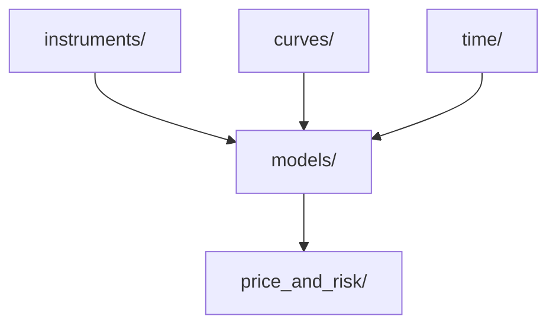

# Quantpy

A derivatives pricing library for interest rates and FX, built from scratch in Python with no third-party pricing libraries. 207 passing tests.

## Architecture

Instruments, market data, and time utilities are independent layers that feed into a pricing engine. Models always return undiscounted cashflows - discounting is always handled by `price_and_risk/`, so models are interchangeable without touching the valuation layer.



- **`instruments/`** - contract definition: dates, notionals, currency, payoff structure. No pricing logic, no market data.
- **`curves/`** - IR discount curves and FX rate curves with configurable interpolation.
- **`time/`** - day count conventions, date rolling, holiday calendars, cashflow scheduling.
- **`models/`** - pricing logic; always returns undiscounted `CashFlowSchedule` objects.
- **`price_and_risk/`** - discounting, FX conversion, and Greeks via bump-and-reprice.

## Coverage

### FX Forwards

Priced analytically via covered interest rate parity. Cross-rates derived as F(term/base) = F(USD/base) / F(USD/term), so any currency pair can be priced from two USD-denominated FX curves. Full example: [examples/fx_forward.py](examples/fx_forward.py)

```python
# Model converts the payoff to USD — DCFPricer discounts a single USD cashflow
model = FXForwardModel(valuation_date=..., base_fx_curve=eur_curve, term_fx_curve=aud_curve)
spec = PricingSpec(model=model, instrument=forward, discount_curve=ir_curve)
result = DCFPricer(spec).discount_cashflows()
```

```
Forward rate:        1.6698 AUD/EUR
Strike:              1.6500 AUD/EUR
Undiscounted payoff: USD 12,954.72
PV:                  USD 12,301.67
```

### Interest Rate Swaps (IRS) and Cross-Currency IRS (CCIRS)

- **Fixed leg** - coupon = notional × rate × accrual yearfrac
- **Floating leg** - forward rates implied from consecutive discount factor ratios
- **OIS leg** - each overnight fixing compounds into the period cashflow; `lookback` is an observation lag (the fixing for day d uses the rate published d − lookback business days prior). For fully forward periods the daily compounding telescopes exactly to the single-period discount factor ratio, so daily iteration only matters when historic and forward-projected rates mix within a live period
- **Seasoned swaps** - first period rate replaced with a historic fixing when valuation date is past the start
- **CCIRS** - `fx_curves` is a per-leg list; set `None` for any leg already in the collateral currency

Full examples: [examples/irs.py](examples/irs.py) | [examples/ccirs.py](examples/ccirs.py)

```python
# IRS: wrap model + instrument + curves in PricingSpec, then price
model = IRSModel(valuation_date=..., leg_two_curve=curve)
spec = PricingSpec(model=model, instrument=irs, discount_curve=curve)
result = DCFPricer(spec).discount_cashflows()
```

```
Fixed leg cashflows (undiscounted):
  2026-12-03  USD -250,000.00
  2027-06-03  USD -250,000.00
  2027-12-03  USD -250,000.00
  2028-06-05  USD -250,000.00

Float leg cashflows (undiscounted):
  2026-09-03  USD  132,317.36
  2026-12-03  USD  129,630.74
  2027-03-03  USD  128,059.57
  2027-06-03  USD  130,603.91
  2027-09-03  USD  126,719.22
  2027-12-03  USD  125,333.24
  2028-03-03  USD  125,333.24
  2028-06-05  USD  126,972.89

PV (discounted): USD 30,049.88
```

```python
# CCIRS: same pipeline — assign an FX curve to any foreign-currency leg
spec = PricingSpec(model=model, instrument=ccirs, discount_curve=usd_curve, fx_curves=[eur_fx, None])
result = DCFPricer(spec).discount_cashflows()
```

```
EUR fixed leg cashflows (undiscounted):
  2026-12-03  EUR -250,000.00  (~USD -270,256.83)
  2027-06-03  EUR -250,000.00  (~USD -270,514.56)
  2027-12-03  EUR -250,000.00  (~USD -270,895.57)
  2028-06-05  EUR -250,000.00  (~USD -271,270.81)

USD float leg cashflows (undiscounted):
  2026-09-03  USD  132,317.36
  ...
  2028-06-05  USD  126,972.89

PV (discounted): USD -47,724.19
```

## Implementation

### `time/`
- [x] Day count conventions - ACT/360, ACT/365, 30/360, 30/365, BUS/252; scalar, array, and paired start/end array inputs
- [x] Date rolling - Modified Following, Modified Preceding, Following, Preceding; holiday-aware payment lag
- [x] Holiday calendars
- [x] Cashflow scheduling - `CashFlowSchedule` (explicit dates) and `PeriodicCashFlowSchedule` (frequency-driven, backward from end date) with separate accrual and payment date arrays
- [x] Historic OIS fixing date generation

### `utils/`
- [x] Interpolator - linear, log-linear, cubic spline, monotonic cubic spline (PCHIP), Akima
- [x] Enumerations - `Currency`, `Frequency`, `Daycount`, `Dateroll`, `PayReceive`, `FloatingIndex`, `BuySell`, `InterpolationMethod`

### `instruments/`
- [x] FX Forward
- [x] Interest Rate Swap - `IRFixedLeg`, `IRFloatingLeg`; pay/receive, payment lag, OIS lookback

### `curves/`
- [x] FX Curve - currency_2/currency_1 quote convention; configurable interpolation (default log-linear)
- [x] IR Curve - accepts zero rates or discount factors and derives the other; configurable interpolation (default log-linear)

### `models/`
- [x] FX Forward Model - analytic pricing via covered interest rate parity
- [x] IRS Model - fixed leg, floating IBOR leg (forward rates via DF ratio); OIS leg (forward periods via DF ratio); live and seasoned swaps; single and cross-currency

### `price_and_risk/`
- [x] DCF engine - per-schedule FX curve assignment with currency validation; single-currency and cross-currency
- [x] Greeks - `parallel_dv01(shock)` central difference bump-and-reprice; shocks all IR curves in model + discount curve; additivity verified (DV01(IRS) = DV01(fixed leg) + DV01(floating leg))

### Up next
- [ ] FX delta - CIP-consistent FX curve shocking; `Greeks.fx_delta()`
- [ ] Vanilla options - IR caps/floors and FX vanilla options (Garman-Kohlhagen)
- [ ] Volatility surface - construction and interpolation
- [ ] SABR model - stochastic volatility for IR smile
- [ ] Monte Carlo engine - path generation and LSM for early exercise
- [ ] Curve bootstrapping - par rates to zero rates
