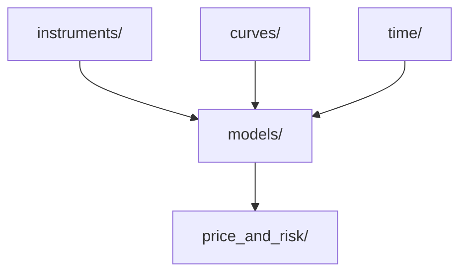

# Quantpy

A Python library for pricing and risk management of derivatives across interest rates, FX, and equity asset classes.

## Architecture

Quantpy follows a fan-in architecture with three independent input layers converging into a single output layer

### Layer Responsibilities

- **`instruments/`** - Defines the contract - payoff structure, contractual dates, strikes, notionals, currency. Exposes payoff(spot) or cashflows(path) interface called by models.
- **`curves/`** - Defines market data (FX rates, Interest Rates, Volatility, etc.)
- **`models/`** - Ingests `instruments/` and `curves/` and performs pricing logic via Monte Carlo, PDE, or analytic methods. Always returns a CashFlowSchedule with amounts filled in, undiscounted.
- **`price_and_risk/`** - Applies discount factors from `curves/`. Aggregates across paths for Monte Carlo, computes greeks via shock-and-reprice.
- **`time/`** - All date and time logic. Daycounts, Daterolls, Holidays, Cashflow scheduling.

## Coverage

### Asset Classes
- ...

### Models
- ...

## Project Status
- [x] Day count conventions
- [x] Date rolling conventions
- [x] Holiday calendars
- [x] CashFlowSchedule
- [x] FX Forward Instrument
- [ ] FX Curve